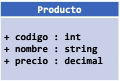

# Programación orientada a objetos

## ¿Qué es la programación orientada a objetos?

La Programación Orientada a Objetos \(POO u OOP según sus siglas en inglés\) es un paradigma de programación que usa objetos y sus interacciones para diseñar aplicaciones y programas de computadora. Está basado en varias técnicas, incluyendo herencia, modularidad, polimorfismo, y encapsulamiento. Su uso se popularizó a principios de la década de 1990. Actualmente son muchos los lenguajes de programación que soportan la orientación a objetos.

La programación Orientada a objetos \(POO\) es una forma especial de programar, más cercana a como se expresan las cosas en la vida real que otros tipos de programación.

La POO es un **paradigma** de la programación de computadores; esto hace referencia al conjunto de teorías, estándares, modelos y métodos que permiten organizar el conocimiento, proporcionando un medio bien definido para visualizar el dominio del problema e implementar en un lenguaje de programación la solución a ese problema.

La POO se basa en el modelo objeto, donde el elemento principal es le objeto, el cual es una unidad que contiene todas sus características y comportamientos en sí misma, lo cual lo hace como un todo independiente, pero que se interrelaciona con objetos de su misma clase o de otras clase, como sucede en el mundo real.

## Conceptos Fundamentales de la POO

La programación orientada a objetos es una forma de programar que trata de encontrar una solución a estos problemas. Introduce nuevos conceptos, que superan y amplían conceptos antiguos ya conocidos. Entre ellos destacan los siguientes:

### Clase

Definiciones de las propiedades y comportamiento de un tipo de objeto concreto. La instanciación es la lectura de estas definiciones y la creación de un objeto a partir de ellas.

### Objeto

Instancia de una clase. Entidad provista de un conjunto de propiedades o atributos \(datos\) y de comportamiento o funcionalidad \(métodos\), los mismos que consecuentemente reaccionan a eventos. Se corresponden con los objetos reales del mundo que nos rodea, o con objetos internos del sistema \(del programa\). Es una instancia a una clase.

### Método

Algoritmo asociado a un objeto \(o a una clase de objetos\), cuya ejecución se desencadena tras la recepción de un “mensaje”. Desde el punto de vista del comportamiento, es lo que el objeto puede hacer. Un método puede producir un cambio en las propiedades del objeto, o la generación de un “evento” con un nuevo mensaje para otro objeto del sistema.

### Mensaje

Una comunicación dirigida a un objeto, que le ordena que ejecute uno de sus métodos con ciertos parámetros asociados al evento que lo generó

### Comportamiento

Está definido por los métodos o mensajes a los que sabe responder dicho objeto, es decir, qué operaciones se pueden realizar con él.

### Evento

Es un suceso en el sistema \(tal como una interacción del usuario con la máquina, o un mensaje enviado por un objeto\). El sistema maneja el evento enviando el mensaje adecuado al objeto pertinente. También se puede definir cómo evento la reacción que puede desencadenar un objeto; es decir, la acción que genera.

### Atributos

Características que tiene la clase

### Propiedad o atributo

Contenedor de un tipo de datos asociados a un objeto \(o a una clase de objetos\), que hace los datos visibles desde fuera del objeto y esto se define como sus características predeterminadas, y cuyo valor puede ser alterado por la ejecución de algún método.

### Componentes de un objeto

Atributos, identidad, relaciones y métodos.

### Identificación de un objeto

Un objeto se representa por medio de una tabla o entidad que esté compuesta por sus atributos y funciones correspondientes.

**Private**: solo visible para la clase que lo contiene. 

## Pilares de la POO

La **POO** tiene tres tipos de propiedades que permiten facilitar esta forma de programar y en esta materia  explicaremos cada una ellas que son: la encapsulación, herencia y polimorfismo, veremos a lo largo de la misma, ejemplos prácticos 

### **Polimorfismo**

La palabra polimorfismo viene del griego pilo que significa muchas y morfismo que significa formas, es decir, muchas formas. El polimorfismo en es la capacidad que tienen los objetos de diferentes clases para usar un comportamiento o atributo del mismo nombre pero con diferente valor \(es decir métodos con mismo nombre pero diferente comportamiento\).

Un ejemplo de clases, objetos y métodos se puede observar que todos los vehículos tienen la capacidad de desplazarse pero no se desplazan de la misma manera, dado que una moto se desplaza sobre dos ruedas y un coche se desplaza sobre cuatro, eso es el polimorfismo, otro caso mas concreto, es la sobrecarga del método ToString\(\)**.**

### **Encapsulación**

La encapsulación es una forma de darle uso exclusivo a los comportamientos o atributos que posee una clase, es decir, protege esos atributos y comportamientos para que no sean usados de manera externa.

La encapsulación es el proceso de ocultar el funcionamiento interno de nuestras clases. Eso significa que especificamos una especificación pública, utilizada por los consumidores de nuestra clase, mientras que el trabajo real está oculto. La ventaja es que una clase puede cambiar su funcionamiento sin necesidad de cambiar a sus consumidores. En C \# tenemos cuatro palabras clave de modificadores de acceso que permiten cinco formas de controlar la visibilidad del código:

**Protected**: solo visible para la clase que lo contiene y los herederos. 

**Intern**: solo visible para las clases en el mismo ensamblado. 

**Public**: visible para todos.

### Herencia

La Herencia explica que puede crearse un objeto a partir de otro objeto ya existente. El nuevo objeto hereda todas las cualidades del objeto del que deriva y además puede añadir nuevas funcionalidades o modificar las ya existentes.

La herencia es una parte importante de cualquier lenguaje orientado a objetos. Las clases pueden heredarse entre sí, lo que significa que la clase heredada obtiene todo el comportamiento de la clase heredada, también conocida como la clase base.

